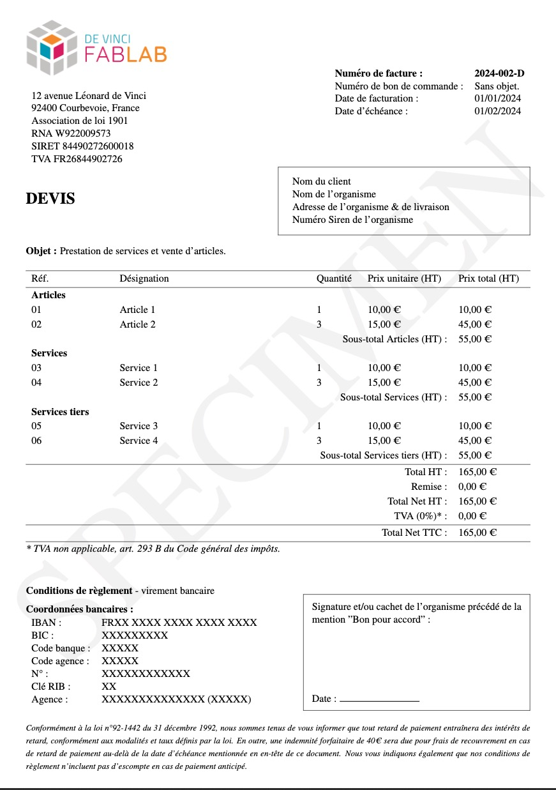

# Invoice-templates

> This repository contains a collection of invoice templates created for the association.



> [!WARNING]
> The templates are written in French.

## Features

- [x] [**Invoice template**](/facture/)
- [x] [**Quote template**](/devis/)
- [x] [**Receipt template**](/reçu_de_paiement/)
- [x] [**Tax receipt template**](/reçu_fiscal/)
- [x] [**Expense report template**](/note_de_frais/)

## How to use

### Prerequisites

- The distribution matching your architecture or your needs of [LaTeX](https://www.latex-project.org/)
- A code editor like [Visual Studio Code](https://code.visualstudio.com/) (with the correct extensions for LaTeX) or a LaTeX editor like [TeXShop](http://pages.uoregon.edu/koch/texshop/)

### Installation

1. Clone the repository

```bash
git clone https://github.com/DeVinci-FabLab/Invoice-templates.git
```

2. Open the template you want to use with your LaTeX editor

3. Edit the template with your information

4. Compile the template

5. Collect the pdf file generated

## License

This project is licensed under the MIT License - see the [LICENSE](LICENSE) file for details
