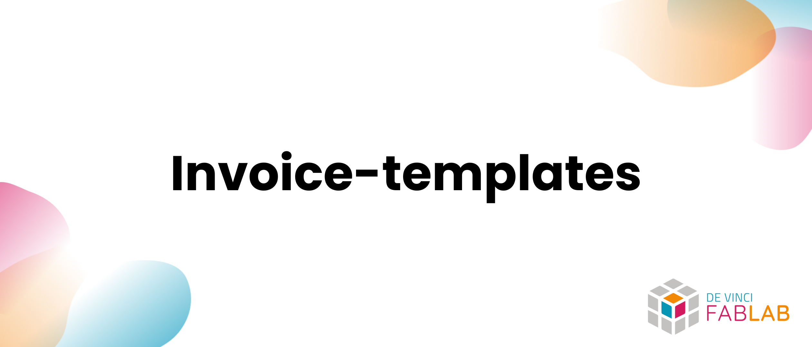
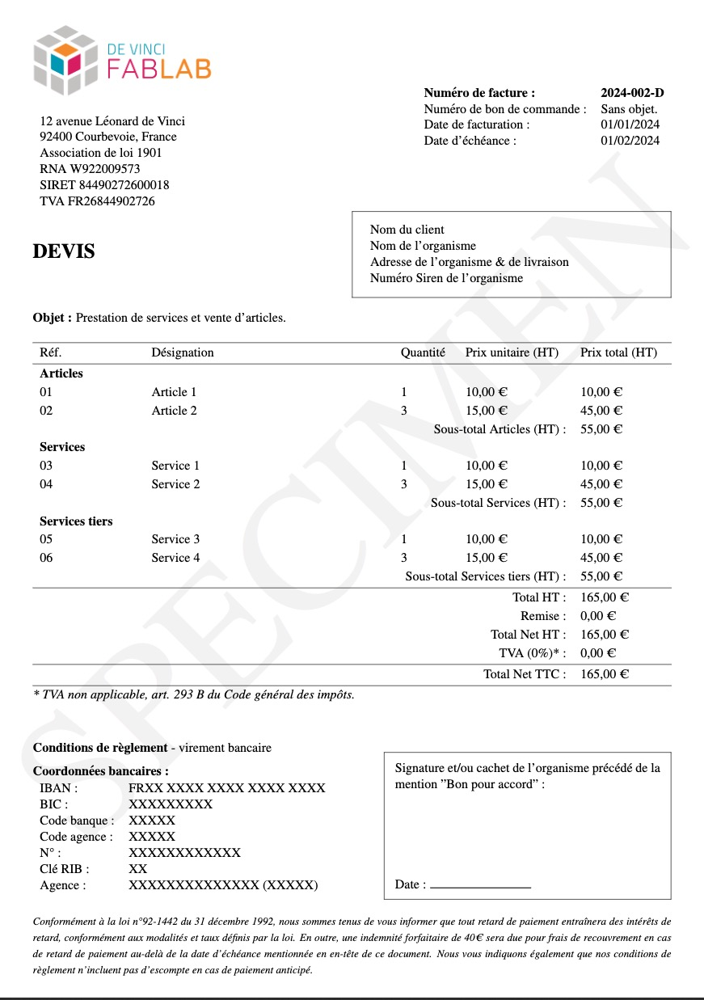

## Overview

> Collection of invoice templates created for the association.

Available templates:

- [x] [**Invoice template**](/facture/)
- [x] [**Quote template**](/devis/)
- [x] [**Receipt template**](/reçu_de_paiement/)
- [x] [**Tax receipt template**](/reçu_fiscal/)
- [x] [**Expense report template**](/note_de_frais/)

## Getting Started

- [Overview](#overview)
- [Getting Started](#getting-started)
  - [Example](#example)
  - [How to use](#how-to-use)
    - [Prerequisites](#prerequisites)
    - [Installation](#installation)
    - [Editing](#editing)
  - [Supported languages](#supported-languages)
  - [Roadmap for future improvements](#roadmap-for-future-improvements)
  - [Contributing](#contributing)
  - [License](#license)

### Example

Here is an example of an quote template:



### How to use

#### Prerequisites

- The distribution matching your architecture or your needs of [LaTeX](https://www.latex-project.org/)
- A code editor like [Visual Studio Code](https://code.visualstudio.com/) (with the correct extensions for LaTeX) or a LaTeX editor like [TeXShop](http://pages.uoregon.edu/koch/texshop/)

#### Installation

Clone the repository using:

```bash
git clone https://github.com/DeVinci-FabLab/Invoice-templates.git
```

#### Editing

Open the project, then update the `templates/common/payement_info.tex` file with your information.

Create the folder `templates/WIP` (Work In Progress), then copy / paste the templates you want to edit in this folder.

When editing you template, do not forget to remove the `\input{../common/watermark.tex}` line as it will apply a watermark on the document.

Using your editor, you may compile the document to see the result and export it as a PDF.

### Supported languages

- English 🇬🇧 (code)
- French 🇫🇷 (content)

### Roadmap for future improvements

> [!WARNING]
> This repository is to be integrated into the [MyFab](https://github.com/DeVinci-FabLab/MyFab-Home) platform.

### Contributing

If you want to contribute to the project, please read the [CONTRIBUTING](./.github/CONTRIBUTING) file and contact the project manager.

### License

This project is licensed under the MIT License - see the [LICENSE](LICENSE) file for details
